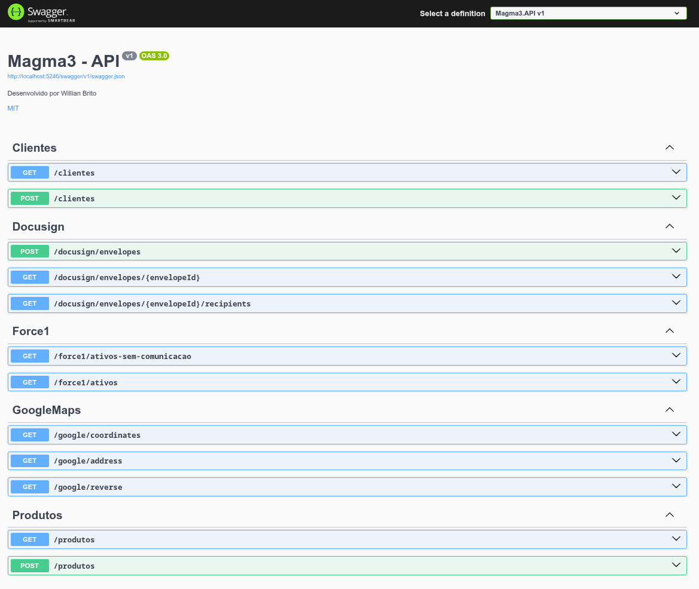

# 🏢 Magma3
Este repositório foi criado para realizar o teste técnico para o cargo de analista de desenvolvimento de software  pleno da empresa Magma3.

## 🛠️ Tecnologias
- .NET 8
- MongoDB
- Swagger

## 1️⃣ Questão 1
```http
GET /force1/ativos-sem-comunicacao
```

## 2️⃣ Questão 2
```http
GET /produtos

POST /produtos
```

## 3️⃣ Questão 3
```http
GET /clientes

POST /clientes
```

## 4️⃣ Questão 4

#### Codigo original:
```csharp
public async Task<Ativo> PegaAtivos(string cidade)
{
    HttpClient client = new HttpClient();

    var resposta = await client.GetAsync(
        $"https://api.magma-3.com/v2/Force1/GetAssets");

    var conteudo = resposta.Content.ReadAsString();

    Ativo ativo = JsonConvert.DeserializeObject<Ativo>(conteudo);

    return ativo;
}
``` 

#### Problemas identificados:

1. O parâmetro `cidade` não é utilizado.
1. `HttpClient` é instanciado diretamente (não utiliza DI).
1. `ReadAsString()` não existe.
1. Deve ser utilizado `ReadAsStringAsync()`.
1. Faltou o `await` no `ReadAsStringAsync()`.
1. Não há validação do status HTTP.
1. Não há tratamento de exceções.
1. O endpoint retorna uma coleção de ativos e não um único objeto.
1. Não existe autenticação na API Force1.

#### Endpoint corrigido:
```http
GET /force1/ativos
```

## 5️⃣ Questão 5

#### Google Maps SDK
- Geocode
- Reverse Geocode
- Search Address

#### DocuSign SDK
- Create Envelope
- Get Envelope
- List Recipients

#### Microsoft Graph SDK
- Get Users
- Send Mail
- Get Events

#### Endpoints para teste

```http
GET /google/coordinates

POST /docusign/envelope

GET /graph/users
```

## 📝 Swagger
